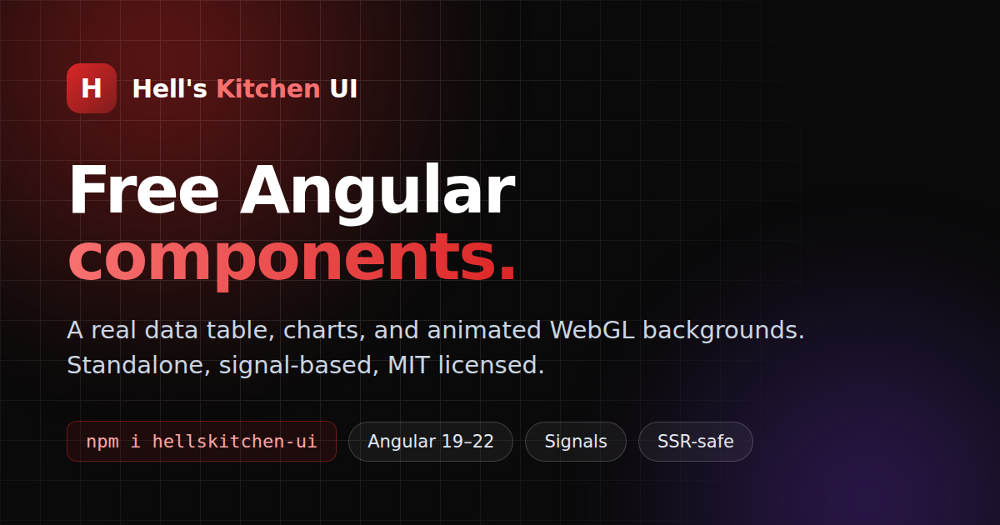

# Hell's Kitchen UI — free Angular component library

[](https://hellskitchen-ui.pages.dev)

Free, MIT-licensed **Angular components** for Angular 19, 20, 21 and 22: a real
**data table** with sorting, filtering, grouped headers, virtual scroll and CSV
export, **line and bar charts**, a themeable **button**, and eight **animated
WebGL backgrounds**. Standalone, signal-based, SSR-safe — no Tailwind, no icon
font, no global stylesheet.

**[Live docs and demos →](https://hellskitchen-ui.pages.dev)** · **[All components →](https://hellskitchen-ui.pages.dev/components/)** · **[npm →](https://www.npmjs.com/package/hellskitchen-ui)**

[](https://www.npmjs.com/package/hellskitchen-ui)
[](https://www.npmjs.com/package/hellskitchen-ui)
[](./LICENSE)


```bash
npm i hellskitchen-ui
```

## What ships, and what does not

This repository holds two things, and the difference matters:

| | What it is | Published? |
| --- | --- | --- |
| `projects/hk-ui` | The library: button, data table, charts, eight animated backgrounds | **Yes** — `hellskitchen-ui` |
| `src` | The documentation site, and ~60 demo components | No |

The catalogue on the site documents far more components than the package
exports. **Those extra entries are reference implementations, not exports** —
self-contained code you can read and copy, written to show how the pattern is
built. Only the four families in `projects/hk-ui` are importable from npm.

Every component is standalone and signal-based, styled with plain CSS. The
package pulls in no Tailwind, no icon font and no global stylesheet.

## Layout

```
projects/hk-ui/src/lib/   the library — button, table, charts, backgrounds
projects/hk-ui/src/       public-api.ts: the entire published surface
src/app/shared/demos/     demo components rendered by the docs site
src/app/shared/data/      the component catalogue (drives the site)
src/app/modules/          the site itself — home, catalogue, docs
```

## Developing

The docs site resolves `hellskitchen-ui` to the **built** library in
`dist/hk-ui`, so it consumes exactly what npm ships rather than the source. That
means the library has to be built first — the npm scripts handle it, so prefer
them over bare `ng` commands:

```bash
npm start          # builds the library, then serves the docs site
npm run build      # builds the library, then the site
npm run test:all   # both suites: library, then site
```

Library-only:

```bash
npm run build:lib
npm run test:lib
```

## Publishing

```bash
npm login
npm run pack:lib      # inspect the tarball first — always worth it
npm run publish:lib
```

`publishConfig.access` is already `public`, so a scoped package publishes
without extra flags. Bump `version` in `projects/hk-ui/package.json` before each
release; npm will not accept the same version twice, and it cannot be renamed
afterwards.

## Contributing

Both suites must pass:

```bash
npm run test:all
```

If you add a component to the library, export it from
`projects/hk-ui/src/public-api.ts` — anything not re-exported there is internal
and can change without it being a breaking change.

## Licence

MIT — see [LICENSE](./LICENSE).
